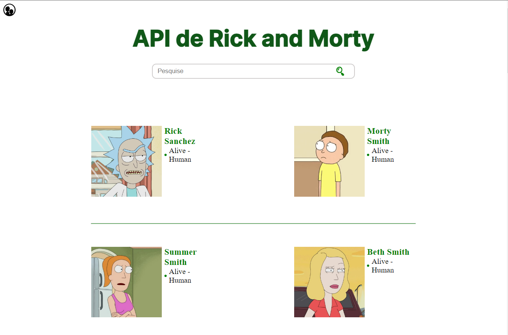

# Página consumindo a API do Rick And Morty

## Projeto desenvolvido como estudo, envolvendo consumo de API e montagem dinâmica de página

### Página disponível <a href='https://mateussilva42.github.io/Api-Rick-and-Morty/' targer='_blank'>Aqui</a>

### Documentação da API utilizada <a href='https://rickandmortyapi.com/documentation/#rest' targer='_blank'>Aqui</a>

